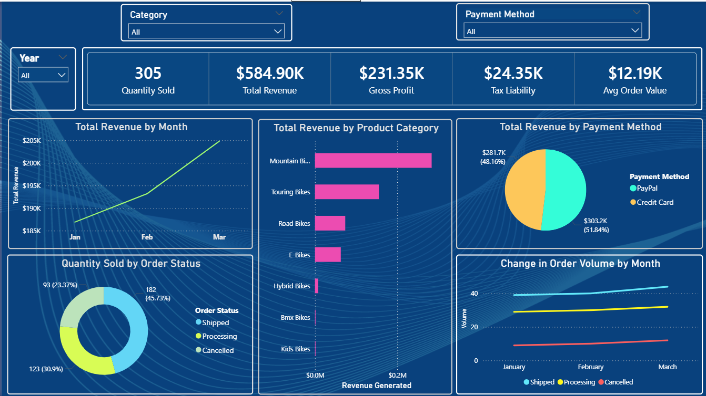
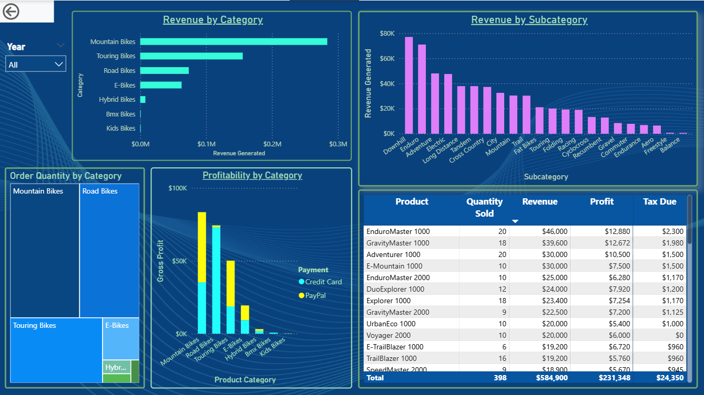
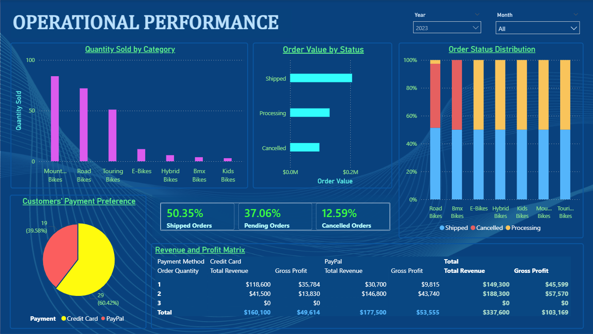
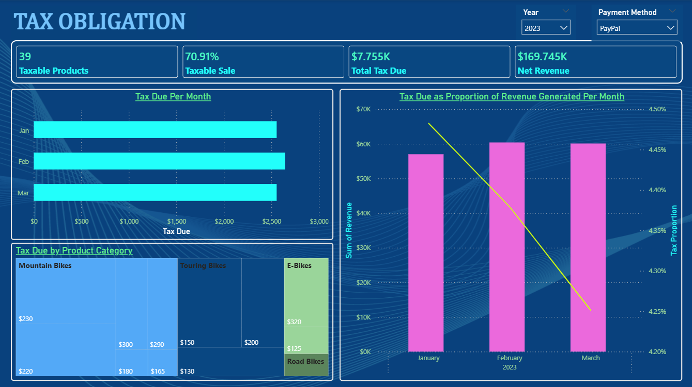

<h1 align = "center"> 
Starter Bike LLC Sales Analytics  
Dashboard
</h1>

# Repository Structure

    Bike-Sales-PowerBI-Project/

    │
    ├── 01 Project Charter/
    │   └── project_charter.md
    │
    ├── 02 Business Requirements/
    │   └── business_requirement_document.pdf
    │
    ├── 03 Documentation/
    │   ├── Business Questions.md
    │   ├── Data Cleaning Report.md
    │   ├── Data Dictionary.md
    │   └── Insights.md
    │
    ├── 04 Data/
    │   └── data_audit/
    │       ├── data_audit_report.md
    │       ├── data_profile_summary.pdf
    │       └── data_quality_checklist.md
    │  
    │   ├── processed/
    │   └── raw/
    │       └── Quarter-One-Report-Workbook.xlsx
    │
    ├── 05 Reports/
    │   ├── Bike Sales Dashboard.pbix
    │   └── 
    │
    ├── 06 Power Query/
    │
    ├── 07 DAX/
    │   ├── Calculations.md
    │   └── Measures.md
    │
    ├── 08 Images/
    │
    ├── LICENSE
    │
    └── README.md

# Background

Starter Bike LLC, a fictional bicycle retailer, is looking to obtain insights from its Q1 operations over the past years. Company executives believe that data from the 2022 and 2023 Q1 sales can provide some critical insights into how the company performs during the first quarter of each financial year. 

They believe that, with proper analytics, the company can efficiently track essential performance indicators, including, but not limited to, product performance, profitability, tax liabilities, and operational efficiency, which can then inspire the company to optimize sales operations and improve revenue generation. 

The 2022 and 2023 Q1 sales operation data has been successfully consolidated and readily available. However, despite having operational data readily available, the management still lacks a centralized reporting solution that transforms this raw information into meaningful business insights.

In seeking a working solution, company executives have asked for an analytical dashboard that will aid in decision-making by cutting the time decision-makers would spend compiling reports manually. The underlying need is to make it simpler to identify revenue drivers, evaluate product performance, monitor operational efficiency, and estimate tax obligations. 

The executives forsee that as the business is destined to scale, manual reporting will soon become increasingly inefficient particularly since it's prone to error.

## Project Objective

This project aims to transform the company's transactional sales data into an interactive Business Intelligence solution using Microsoft Power BI.

# Business Problem

Starter Bike LLC, has generated sales every day but lacks visibility into its overall business performance.

Company executives say it still takes effort to answer critical operational questions such as:

- Which products contribute the most to revenue?
- Which product categories are the most profitable?
- How much tax liability does the business incur?
- Which products trigger the highest tax expense?
- How are sales changing over time?
- Which orders are successfully completed versus cancelled?
- Where are operational inefficiencies occurring?

Without these insights, company executives believe there is a relatively substantial risk of making decisions based on assumptions rather than evidence.

# Project Goal

This project is designed to provide an interactive Power BI dashboard that can enable Starter Bike LLC executives to monitor sales performance, product performance, operational efficiency, and tax obligations to support evidence-based business decision-making.

The dashboard is, therefore, intended to enable management to monitor:

## Sales Performance
- Total revenue generated.
- Sales trends over time.
- Order value.
- Order volumes.

## Product Performance
- Top-performing products.
- Similarities and differences in product categories.
- Product profitability.
- Product contribution to total revenue.

## Operational Performance
- Order status distribution.
- Risk of order cancellation.
- Operational efficiency.
- Products with high risk of cancellation.

## Tax Analysis
- Tax liability.
- Tax contribution by product and category.

# Executive Reporting

Provide an interactive dashboard allowing executives to filter results by:

- Year, Month or Date
- Product Category
- Order Status

<h1 align = "left"> 
Power BI Report Interface
</h1>

<h2 align = "center"> 
Page 1: Executive Overview
</h2>

### Key Findings:

- In the first quarter of 2023, Sarter Bike LLC sold a total of 178 bikes, earning a total of $337,600 in revenue and $133,560 in gross profit.

    - The business realized a significant increase in revenue between February and March with January - February reporting a drop in revenue generated.

    - Q1 of 2023 resulted in $13,915 in tax liability

- By category, mountain bikes drive the majority of financial value for the business, followed closely by touring bikes and road bikes respectively    

    - Mountain bikes contributed up to $164,800 in revenue generated in Q1 of 2023

    - Touring bikes came a distant second, contributing $84,000 in revenue, and

    - Road bikes accounted for $46,000 in revenue, 

- March saw an increae in shipped products, after relatively realizing no change in shipped products between January and February.

- The rate of cancelled orders increased steadily between January and March.
---------------------------------------------------------------------------------------------

<h2 align = "center"> 
Page 2: Product Performance
</h2>

### Key Findings:
- Mountain bikes, Turing bikes, Road bikes, E-bikes and Hybrid bikes constituted the top 5 performing categories in Q1 of 2023.

    - Mountain bikes accounted for $164,200 in revenue.

    - Touring bikes accounted for $84,800 in revenue

    - Road bikes accounted for $46,500 in revenue

    - E-bikes contributed $33,200 in revenue, and

    - Hybrid bikes contributed $7,800 in revenue 

- By subcategory, the Downhill brand contributed most toward the revenue generated, contributing up to$49,400 in revenue generated in Q1 of 2023.

- As expected, Mountain bikes were the most sought after type of bike, aking it the most profitable for the business, generating $47,817 in gross profits in that period. 
---------------------------------------------------------------------------------------------

<h2 align = "center"> 
Page 3: Operational Performance
</h2>

### Key Findings:
- Customers paid for most of their orders using credit cards, accounting for more than 60% of payments made.

- Performance-wise, orders for Road bikes were cancelled more than any other category, with up to 49% of placed orders ending up being cancelled.
-----------------------------------------------------------------------------------------------

<h2 align = "center"> 
Page 4: Tax_Obligation
</h2>

### Key Findings:
- In 2023, 39 orders were taxable as per the tax obligation rule afforded the business.

- The 39 taxable products translated in 70.9% of taxable sales made in Q1 of 2023, leading to a total of $7,755 in tax due

- Starter Bike LLC's tax proportion relative to revenue generated in 2023 dropped by 0.23%, ending in 4.25% by March.
-----------------------------------------------------------------------------------------
